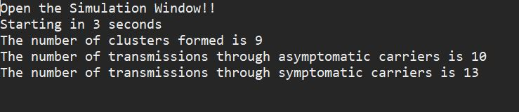

# Coronatime
## Created with Kevin Chen and Andrew Zhu.

CoronaTime is a tool that people can use to understand the spread of disease.
It will feature a UI that shows a population of people moving around over time.
Each person will be a certain color to indicate their exposure to the disease -
healthy, sick, or even infected but asymptomatic. There will be parameters that
the user can input in order to modify the behavior of the population and virus,
testing to see how different characteristics impact the spread of disease.
A graph will also be created to characterize the spread of the disease.

# Program Structure and Initialization
CoronaTime is structured into the following classes: BreadthFirstSearch, Coordinate, Graph,
Main, NetworkModel, Person, and Visualizer. The first three classes (BreadthFirstSearch,
Coordinate, and Graph) are treated as “libraries.” That is, they simply contain helper functions
that we use for the rest of the program. The Person class contains the bulk of the code required
to characterize a person in the population. Key variables to note are their status (healthy/green,
asymptotic/yellow, sick/red, recovered/blue, or dead/black), friends and family, and current coordinates. The
NetworkModel contains the bulk of the backend logic. The Visualizer is a modified Schelling’s
Model Visualizer that displays the change in the population over time. The simulation takes
place on a 200x250 rectangular plane.

## Running the program
Run the main method within the Main Java class.

## Setting Parameters
Upon running the program, the user will be prompted to set a few parameters within the
console. If an invalid number is entered, the user will be asked to enter the number again. If an
invalid character is entered, the user will be notified but will have to restart the program. Below
are the parameters that a user must enter something along the lines of:

## Simulation Length
Simulation length dictates how long the simulation should run for in seconds. To give a
sense of a passage of time, “days” is calculated as every 0.6 seconds.

## Policy
Policy dictates which of the three policies the government will be implementing in this
simulation. The policies are from Table 2 of this paper: [Impact of non-pharmaceutical
interventions (NPIs) to reduce COVID-19 mortality and healthcare demand](https://www.imperial.ac.uk/media/imperial-college/medicine/sph/ide/gida-fellowships/Imperial-College-COVID19-NPI-modelling-16-03-2020.pdfe)

The effects of these policies and associated probabilities are also based on the paper.
They are incorporated into the program as follows:

* Case Isolation in Home (CI)
** The movement behavior for this case is that people who show symptoms are
isolated at home, while everyone else is still allowed to wander outdoors. More
specifically, there is a 25% chance that someone who does not show symptoms
decides to make contact with somebody outside, given that they also pass the
social distance probability (more on this later). Within the household, there is a
50% chance that people will make contact. However, people who are sick will not
seek out contact with people who are not sick. With all that said, the paper found
that there is a compliance rate of about 70%, meaning that there is a 30%
chance that the people behave as normal as if the policy were not in place.

* Individual Voluntary Home Quarantine (HQ)
** The movement behavior for this case is that once somebody gets sick, the whole
family will be asked to stay home as well. Unfortunately, there is only a 50%
compliance rate with these types of measures. For those that do comply, given
the increased density in homes, there is a 100% chance of contact within the
home. For those who are not quarantined, there is actually a 75% chance that
they will choose to make contact, again assuming they pass the social distance
probability. The large percent is due to the perceived safety that anyone who may
be in contact with someone sick is quarantined.

* Social Distancing of Entire Population (SD)
** The movement behavior for this case is that everyone, whether or not they have
symptoms, is asked to maintain some social distance with other people. Given
that this is not a strict quarantine or isolation, but rather people should make less
contact, the compliance is 100%. In this scenario, again there is a 25% chance
that someone who does not show symptoms decides to make contact with
somebody outside, given they pass the social distance check. There is also a
62.5% chance for contact at home.

## Other variables

### Number of Families
Specifies the number of families in the simulation. The population size is calculated
based on the assumption that the size of each family is equal to 4. To ensure that people
have adequate space to move, each number of families is limited to 50.

### Infection Radius
Specifies the number of squares apart two people can stand before there’s a possibility
of an infection.

### Social Distance Radius
Specifies the government mandated distance people should stand apart. However, it is
unrealistic that humans treat this distance literally. That is, people don’t walk around with
rulers. Thus, this variable is factored into the simulation as a probability where a higher
social distance means a lower frequency of outings.

### Initial Asymptotic Population Probability
A decimal specifying the probability that any person in the population starts infected but
asymptotically.

### Initial Sick Population Probability
A decimal specifying the probability that any person in the population starts infected and
shows symptoms.

### Probability that two people are friends
A decimal specifying the probability that any two random people created are friends.

### Infection Rate
A decimal specifying the probability, each cycle of the simulation, that a healthy person
who is within the infection radius of someone with the virus gets the virus.

### Gets Sick Rate
A decimal specifying the probability, each cycle of the simulation, that someone who is
asymptomatic begins to show symptoms.

### Death Rate
A decimal specifying the probability, each cycle of the simulation, that someone who is
sick dies.

### Recover Rate
A decimal specifying the probability, each cycle of the simulation, that someone who is
sick recovers and is immune.

### After setting all of these parameters, the user will be given a warning to switch over to the
simulation tab that just opened in order to view said simulation.

## Visualization and Outputs
Once the simulation starts, the Visualizer will display a timelapse view of the population
progressing. The simulation cycles roughly once every 0.05 seconds, with 12 cycles (0.6
seconds) equalling a day.

While the simulation is running, a graph is also being created in the backend. The graph has
nodes for every single person and tracks the spread of the infection over time. More specifically,
an edge is drawn pointing from the infector to the infectee each time someone new is infected.
At the end of the simulation, BFS is run on the graph and a few diagnostics are printed out, as shown below: 

* Clusters: this metric counts the number of connected components in the graph. It can
be interpreted as how many sources of infections. Thus, a smaller number means a
large percentage of the population got sick from the same source. A larger number
means people got sick from different sources or managed to stay healthy, away from the
source of sickness
* Number of new transmissions through asymptomatic carriers: this metric counts
the number of new cases that are attributed to transmission from an asymptomatic
carrier to a healthy person. A high number suggests that quarantining symptomatic
people only is not enough to curb the spread of virus.
* Number of new transmissions through symptomatic carries: this metric counts the
number of new cases that are attributed to transmission from a symptomatic carrier to a
healthy person. A high number potentially suggests a low compliance rate. Users can
compare this number across different social distance numbers to compare the
effectiveness of social distancing.

